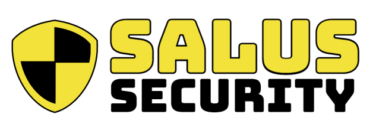
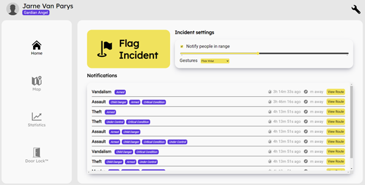
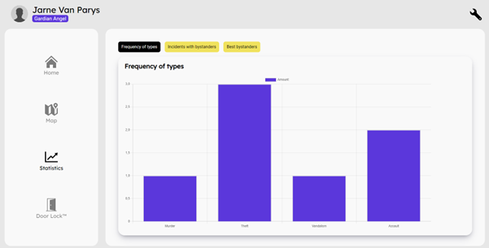

# 
### Client badges

### Server badges

## Table of Contents
- [What is Salus Security?](#what-is-salus-security)
- [Features](#features)
- [Installation](#installation)
    - [Prerequisites](#prerequisites)
    - [Quick Start Server](#quick-start-server-side)
    - [Quick Start Client](#quick-start-client-side)
- [API-Spec](#api-specs)
- [Support](#support)
- [Marketing](#marketing-website)
- [Credits](#credits)

## What is Salus Security?
Salus Security is a company that focuses on the security of Mars-citizens. With our application we want to help the community on Mars keep themselves but more <b>importantly</b> eachother safe in a world without law-enforcements.

## Features
This is a list of every feature in the application.

- Available for all users
    - Flag incident
        - Notification gets send out (for others to assist).
        - A recording will be made of the incident
        - AI will label and validate the crime.
    - View live notifications of reported incincents.
        - The user can get the route towards the incident to assist with the report or help the citizen in danger.
    - A settings page to personalize your notifications and purchase Premium plan.

- Premium Features
    - History
        - Two lists of incident records:
            - incidents you have reported.
            - incidents you have helped reporting.
    - Map
        - A map of incident records with narrow-down options and navigation.
    - Statistics
        - Statistics and Analytics about the reported incidents we have recieved from our users.
        
    - Change the notification range on the homepage

##  Installation
### Prerequisites
- any kind of text-editor 
    - Visual Studio Code
    - IntelliJ
    - ...
- terminal installs
    - Java: openjdk version 11.0.17 (latest)
    - npm: version 8.19.2 
    - sass: version 1.56.1 
    - nodejs: version 18.12.1

*_NOTE:_* make sure you have these versions installed before continuing.
- have both (Server and Client) folders cloned into a directory from gitlab or the following commands:
    - Server: 
    `git clone https://git.ti.howest.be/TI/2022-2023/s3/analysis-and-development-project/projects/group-11/server.git`
    - Client: 
    `git clone https://git.ti.howest.be/TI/2022-2023/s3/analysis-and-development-project/projects/group-11/server.git`

###  Quick start (server side) 
1. 

### Quick start (client side) 
1. 

## API Specs
Our API documentation can by found [here](https://git.ti.howest.be/TI/2022-2023/s3/analysis-and-development-project/projects/group-11/documentation/-/blob/main/api-spec/openapi-mars.yaml ).

## Support
If you have any questions or are interested in becoming a partner/employee, be sure to [contact us](https://sites.google.com/student.howest.be/mars-group11/hr/contact-us?authuser=1).

## Marketing Website
Feel free to take a look at our Marketing Website on our [website](https://sites.google.com/student.howest.be/mars-group11/homepage?authuser=1).

## Credits
- <a target="_blank" href="https://icons8.com/icon/VQOfeAx5KWTK/info">Info</a> icon by <a target="_blank" href="https://icons8.com">Icons8</a>
- Writen by `De Caluwé Branko`