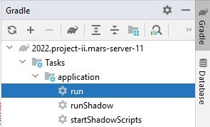
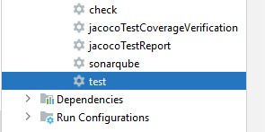

# SALUS SECURITY - MARS PROJECT

# 

## What is Salus Security?
Salus Security is a company that focuses on the security of Mars-citizens. With our application we want to help the community on Mars keep themselves but more **importantly** each other safe. We will be achieving this in a world without law-enforcements.

---
## Quick start
---
Open a terminal and cd in your desired folder. Here you will create three folders for three repositories: client, server and documentation. This is how your directory structure should look like:

```
-- desired folder
		-- documentation
		-- client
		-- server
```

---
### Client: setup
---
If you haven't installed node.js or scss, use these commands:
```
npm i -g npm
npm i scss
```
Clone the following repository
```
cd client

git clone https://git.ti.howest.be/TI/2022-2023/s3/analysis-and-development-project/projects/group-11/client.git
```
Now run the application by connection to a live-server.

If you want to change the scss, it needs to be compiled to css. For this we need a command that runs a watcher:
```
sass --watch .\src\assets\scss\screen.scss .\src\assets\css\screen.css
```
---
### Server: setup
---
Download the latest version of Java (if you haven't already) using this link: https://www.java.com/download/ie_manual.jsp

```
cd server

git clone https://git.ti.howest.be/TI/2022-2023/s3/analysis-and-development-project/projects/group-11/server.git
```
---
### Server: running and tests
---

+ Double click on the indicated field to run the server locally: 

``2022.project-ii.mars-server-11 -> Tasks -> application -> run ``



+ Double click on the indicated field to run the tests: 

``2022.project-ii.mars-server-11 -> Tasks -> verification -> test ``



## Features
this is a list of every feature in the application.
- Available for all users

    - Flag incident
        - Notification gets send out (for others to assist).
        - A recording will be made of the incident
        - AI will label and validate the crime.
    - View live notifications of reported incincents.
        - The user can get the route towards the incident to assist with the report or help the citizen in danger.
    - A settings page to personalize your notifications and purchase Premium plan.

- Premium Features
    - History
        - Two lists of incident records:
            - incidents you have reported.
            - incidents you have helped reporting.
    - Map
        - A map of incident records with narrow-down options and navigation.
    - Statistics
        - Statistics and Analytics about the reported incidents we have recieved from our users.
        
    - change the notification range on the homepage


### Sonar client badges


### Sonar server badges


## API Specs
Our API documentation can by found [here](https://git.ti.howest.be/TI/2022-2023/s3/analysis-and-development-project/projects/group-11/documentation/-/blob/main/api-spec/openapi-mars.yaml ).


## Support
If you have any questions or are interested in becoming a partner/employee , makes sure to [contact us](https://sites.google.com/student.howest.be/mars-group11/hr/contact-us?authuser=1).

## Marketing Website
Feel free to take a look at our Marketing Website on our [website](https://sites.google.com/student.howest.be/mars-group11/homepage?authuser=1).
