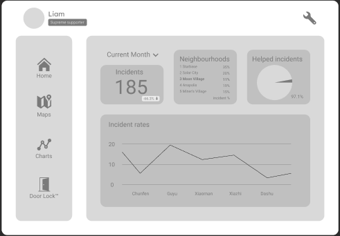

# 
### client badges

### server badges

## What is Salus Security?
Salus Security is a company that focuses on the security of Mars-citizens. With our application we want to help the community on Mars keep themselves but more <b>importantly</b> eachother safe in a world without law-enforcements.

## Quick start 
1. <b>First of all</b> you need clone the client repository
from the gitlab or using the following `command` in 'cmd/git BASH' in your preffered folder. 
    - > git clone https://git.ti.howest.be/TI/2022-2023/s3/analysis-and-development-project/projects/group-11/client.git 

2. <b>Then</b> you open the folder in VS code and go to the index.html file. On this file you Right-mouse-click and open the file with live-server. 
(you won't have this option if you don't have the live-server extention installed. [VS Marketplace Link](https://marketplace.visualstudio.com/items?itemName=ritwickdey.LiveServer) or in extensions by searching for `Live Server`)
3. From here on out, you can explore application.

**_NOTE:_** for flagging incidents or to view the map you need to have your location enabled.

## Features
- Available for all users

    - Flag incident
        - Notification gets send out (for others to assist).
        - A recording will be made of the incident
        - AI will label and validate the crime.
    - View live notifications of reported incincents.
        - The user can get the route towards the incident to assist with the report or help the citizen in danger.
    - A settings page to personalize your notifications and purchase Premium plan.

- Premium Features
    - History
        - Two lists of incident records:
            - incidents you have reported.
            - incidents you have helped reporting.
    - Map
        - A map of incident records with narrow-down options and navigation.
    - Statistics
        - Statistics and Analytics about the reported incidents we have recieved from our users.
        
    - change the notification range on the homepage

## API Specs
Our API documentation can by found [here](https://git.ti.howest.be/TI/2022-2023/s3/analysis-and-development-project/projects/group-11/documentation/-/blob/main/api-spec/openapi-mars.yaml ).

## Support
If you have any questions or are interested in becoming a partner/employee , makes sure to [contact us](https://sites.google.com/student.howest.be/mars-group11/hr/contact-us?authuser=1).

## Marketing Website
Feel free to take a look at our Marketing Website on our [website](https://sites.google.com/student.howest.be/mars-group11/homepage?authuser=1).
