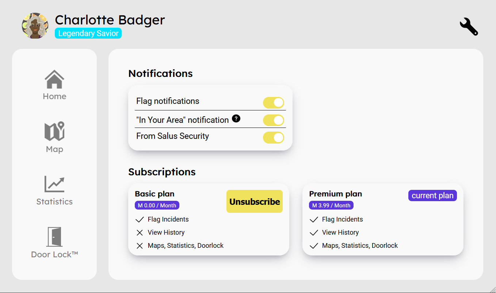
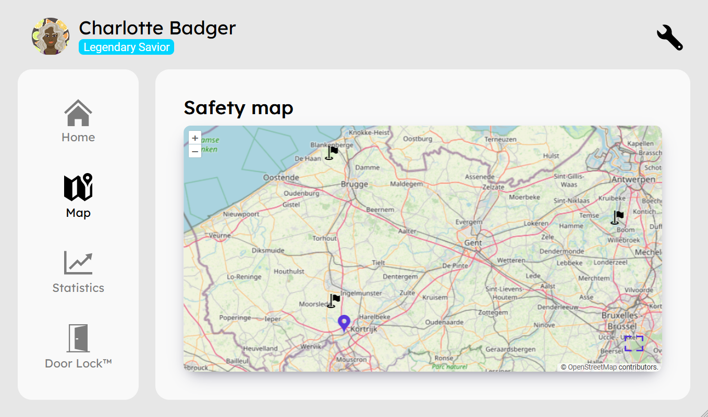
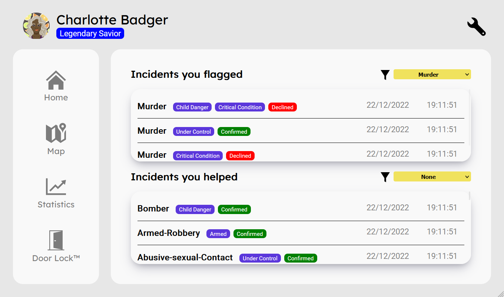

# **SALUS SECURITY - MARS PROJECT**


### Sonar client badges


### Sonar server badges


## Table Of Contents:
- [What is Salus Security?](#what-is-salus-security)
- [Quick start](#quick-start)
	- [Client: Setup](#client-setup)
	- [Client: Running](#client-running)
	- [Server: Setup](#server-setup)
	- [Server: Running and Tests](#server-running-and-tests)
- [Features](#features)
- [API Spec](#api-spec)
- [Support](#support)
- [Marketing Website](#marketing-website)

---
## What is Salus Security?
Salus Security is a company that focuses on the security of Mars-citizens. With our application we want to help the community on Mars keep themselves but more **importantly** each other safe. We will be achieving this in a world without law-enforcements.

---
## Quick start
---
Open a terminal and cd in your desired folder. Here you will create three folders for three repositories: client, server and documentation. This is how your directory structure should look like:

```
-- desired folder
		-- documentation
		-- client
		-- server
```

---
### Client: Setup
---
If you haven't installed node.js or scss, use these commands:
```
npm i -g npm
npm i scss
```
Change your current directory to the client directory and clone the following repository:
```
cd client

git clone https://git.ti.howest.be/TI/2022-2023/s3/analysis-and-development-project/projects/group-11/client.git
```
---
### Client: Running
---

Now run the application by connection to a live-server.

If you want to change the scss, it needs to be compiled to css. For this we need a command that runs a watcher and compiles your css:
```
sass --watch .\src\assets\scss\screen.scss .\src\assets\css\screen.css
```
---
### Server: Setup
---
Download the latest version of Java (if you haven't already) using this link: https://www.java.com/download/ie_manual.jsp

Change your current directory to the server directory and clone the following repository:
```
cd server

git clone https://git.ti.howest.be/TI/2022-2023/s3/analysis-and-development-project/projects/group-11/server.git
```
---
### Server: Running and Tests
---

+ Double click on the indicated field to run the server locally: 

``2022.project-ii.mars-server-11 -> Tasks -> application -> run ``


+ Double click on the indicated field to run the tests: 

``2022.project-ii.mars-server-11 -> Tasks -> verification -> test ``


---
## Features
---
This is a list of every feature in the application.

- Available for all users
    - Flag incident:
      - Pressing the "Flag Incident" will start to record an incident.
      - Every use in your range will receive a notification.
      - While recording: bystanders may join to help you out.
      - After recording: the AI will verify the incident.
      - The incident will be visible on the "Maps" page.
      - AI will also add certain labels to the crime.
  
    - Helping a person with an incident:
      - Anyone can help a person by clicking the "View Route" button on the homepage.
      - The bystander will be shown a direct route to the incident.
      - By clicking the button "Help incident" the bystander will start recording and helping the person in need.

    - The settings page:
      - Anyone can personalize their notifications and change their subscription plan.


- Premium Features
    - Change the notification range on the homepage
    - History:
        - Two lists of incident records:
            - incidents you have reported.
            - incidents you have helped reporting.
    - Map:
        - This map will display all the incidents.
        - By clicking on a desired flag, a route will be calculated to present the closest distance to that flag.
        - A field will appear that asks if you want to help this incident.
        - After clicking, it will take you to the route page.
    - Statistics:
      - Frequency of type of incidents.
      - Incidents with or without bystanders.
      - The best bystanders.
      - Validation frequency

**HOME PAGE:**


**SETTINGS:**



**SAFETY MAP:**



**CHARTS:**


**HISTORY:**



---
## API Spec
---
Our API documentation via Swagger can by found [here](https://project-ii.ti.howest.be/monitor/swagger-ui/?url=https://project-ii.ti.howest.be/monitor/apis/group-11#/).

---
## Support
---
If you have any questions or are interested in becoming a partner/employee, be sure to [contact us](https://sites.google.com/student.howest.be/mars-group11/hr/contact-us?authuser=1).

---
## Marketing Website
---
Feel free to take a look at our Marketing Website on our [website](https://sites.google.com/student.howest.be/mars-group11/homepage?authuser=1).
